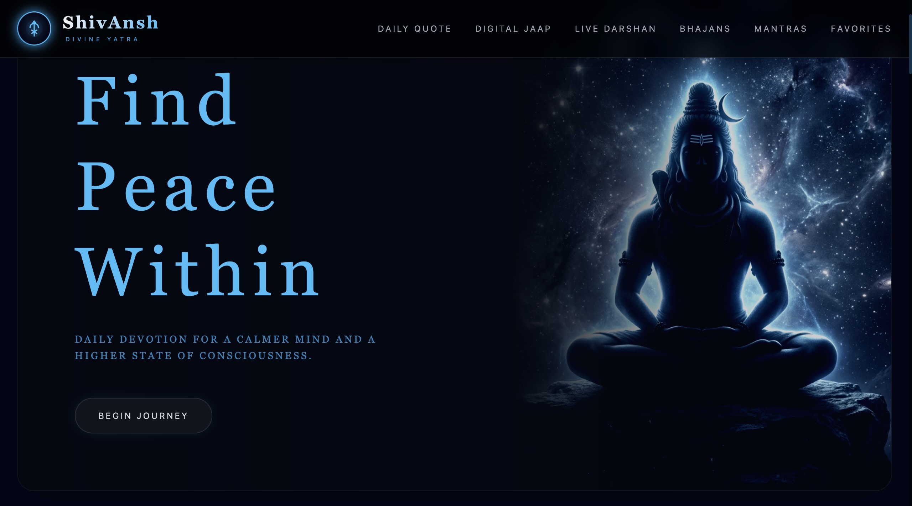
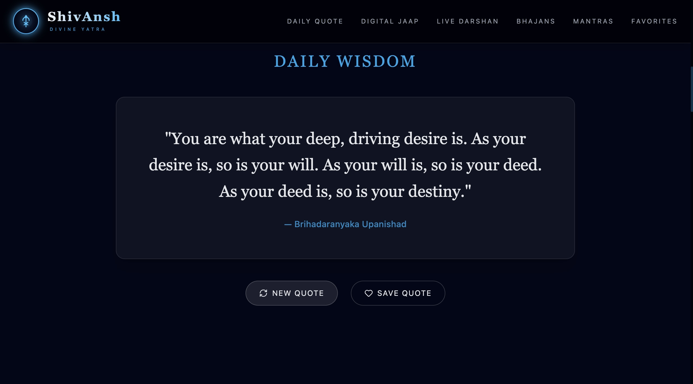
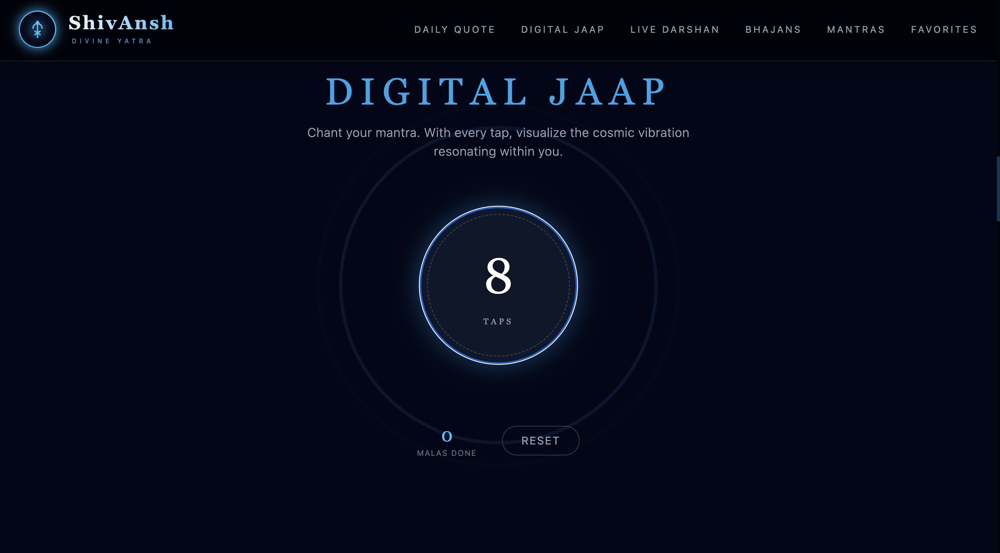
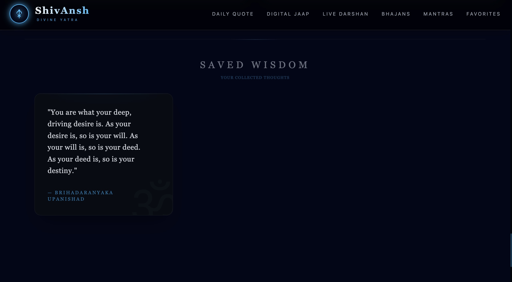

# ShivAnsh – Devotional React Web App 🙏

## 🌟 Overview
ShivAnsh is a modern and immersive devotional web application dedicated to Lord Shiva. It provides a calm and engaging digital space for daily spiritual practices through a clean and interactive interface.

---

## 🚀 Features
- 🧘 Daily spiritual quotes for positivity  
- 🔢 Interactive jaap counter for mantra tracking  
- 🎵 Devotional bhajans collection  
- 📿 Sacred mantras section  
- ❤️ Save favorites using local storage  
- 📡 Live darshan integration (with fallback support)

---

## 🛠️ Tech Stack
- React (Vite)  
- Tailwind CSS  
- Framer Motion  
- Lucide React  

---

## 🎨 UI/UX Highlights
- Dark theme with saffron & gold accents  
- Smooth animations and micro-interactions  
- Glassmorphism-inspired design  
- Fully responsive across devices  

---

## 📸 Screenshots

<p align="center">
  
  
</p>

<p align="center">
  
  
</p>

---

## ⚙️ Installation & Setup

```bash
git clone https://github.com/your-username/shivansh-devotional-app.git
cd shivansh-devotional-app
npm install
npm run dev
